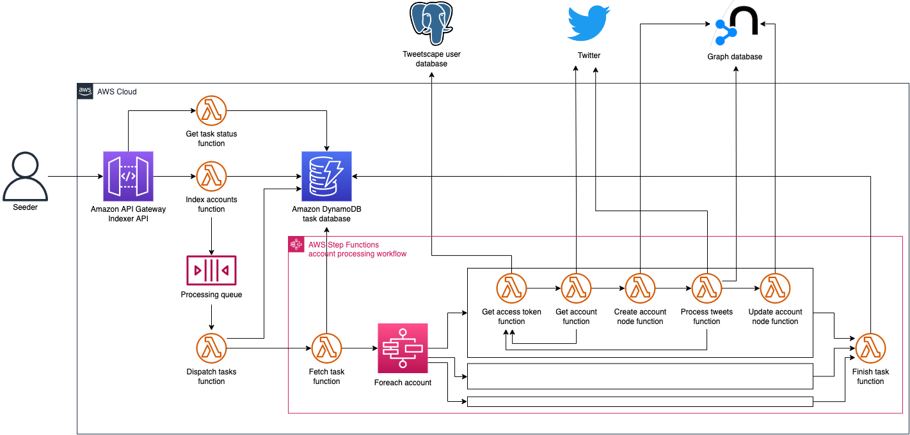

# Queueing System on AWS

## Cost estimates

In N.Virginia (`us-east-1`) region.
Monthly.
As of Nov. 15, 2022.

### Passive cost

- [AWS SecretsManager](https://aws.amazon.com/secrets-manager/pricing/)
    - Secret: $0.40
- [Amazon DynamoDB on demand](https://aws.amazon.com/dynamodb/pricing/on-demand/)
    - Storage: $0.25 / GB (25 GB free tier)
- [AWS Certificate Manager](https://aws.amazon.com/certificate-manager/pricing/)
    - Free

Assumptions,
- We will have one secret to store database credentials. &rightarrow; $0.40
- We will have another secret to store API key. &rightarrow; $0.40
- DynamoDB's storage will be within the free tier for a while.
- No DynamoDB replication.
- No DynamoDB backup.

Passive cost: **$0.80**

If we have two deployment stages: **$1.60**

### Pay-as-you-go cost

Monthly.

- [AWS Lambda](https://aws.amazon.com/lambda/pricing/)
    - Requests: $0.20 / 1M requests (1M free tier)
    - Duration: $0.0000133334 / GB-second (400,000 GB-second free tier)
- [AWS Step Functions](https://aws.amazon.com/step-functions/pricing/)
    - State transitions: $0.025 / 1,000 transitions (4,000 free tier)
- [Amazon Simple Queue Service (SQS)](https://aws.amazon.com/sqs/pricing/)
    - Requests: $0.40 / 1M requests (1M free tier)
- [Amazon DynamoDB on demand](https://aws.amazon.com/dynamodb/pricing/on-demand/)
    - Write Request Units (WRU): $1.25 / 1M WRUs
    - Read Request Units (RRU): $0.25 / 1M RRUs
- [Amazon API Gateway](https://aws.amazon.com/api-gateway/pricing/)
    - Tiny fraction

One AWS Lambda function periodically polls SQS, and there are 5 concurrent polling jobs according to [this SO comment](https://stackoverflow.com/a/59452929).
So the polling interval matters.
- 1 polling per 1 second: 86,400 * 5 = 432,000 / day &rightarrow; 12,960,000 / month &rightarrow; 11,960,000 (-1M free) * $0.20 = $2.392
- 1 polling per 5 seconds: 17,280 * 5 = 86,400 / day &rightarrow; 2,592,000 / month &rightarrow; 1,592,000 (-1M free) * $0.20 = $0.3184
- 1 polling per 10 seconds: 8,640 * 5 = 43,200 / day &rightarrow; 1,296,000 / month &rightarrow; 296,000 (-1M free) * $0.20 = $0.0592

Suppose there is a request for processing of 1,000 users.
- DynamoDB
    - 1,000 WRU &rightarrow; $0.00125
    - 1,000 RRU &rightarrow; $0.00025
- Lambda
    - Requests: 1 + 1 + 1 + 1 + 5 * 1,000 = 5,005 &rightarrow; $0.001001 (suppose no free tier)
    - Duration: hard to estimate but should be within the free tier
- Step functions
    - State transitions: 1 + 1 + 5 * 1,000 = 5,002 &rightarrow; $0.12505 (suppose no free tier)

One time cost to process 1,000 users: **$0.127551** (well less than a dollar)

AWS will charge for in/out-bound data transfer, and the cost is hard to estimate.
However, it should be tiny fraction.